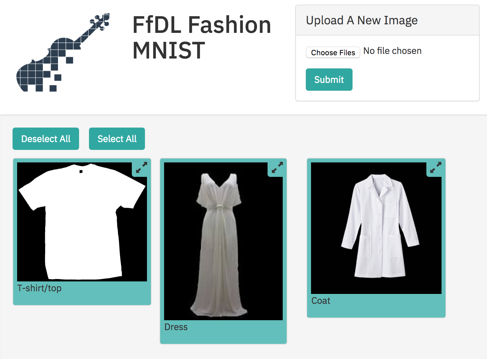
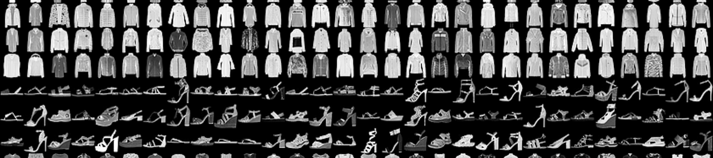

# Fashion MNIST using FfDL
Train your Fashion MNIST model with [Fabric for Deep Learning (FfDL)](https://github.com/IBM/FfDL) on Kubernetes with GPU

## Steps
1. [Train your Fashion MNIST model with FfDL](fashion-train)
2. [Deploy your Fashion MNIST model with Seldon](seldon-deployment)
3. [Build the FfDL Fashion MNIST Web App and push it on Kubernetes](fashion-mnist-webapp)

## Dataset
Fashion-MNIST is a [dataset provided by Zalando of clothing images](https://github.com/zalandoresearch/fashion-mnist). It is intended to serve as a direct drop-in replacement for the original MNIST dataset for benchmarking ML algorithms. It shares the same image size and structure of training and testing splits, consisting of a training set of 60,000 examples and a test set of 10,000 examples. Each example is a 28x28 grayscale image, associated with a label from 10 classes

## Appropriate Test Data

Expects to receive a file path to a picture. Over 30 different file types are supported although only the two (.png and .jpg) have been tested extensively. These file types are listed at (http://pillow.readthedocs.io/en/5.1.x/handbook/image-file-formats.html)

The models trained on the Fashion MNIST data will work best when there is only one object in the picture and the background of the picture is pure black. Additionally, the object in the picture should be completely in frame.
